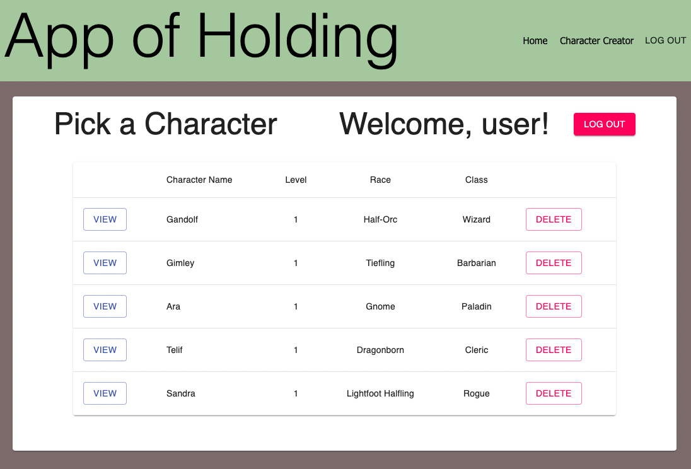
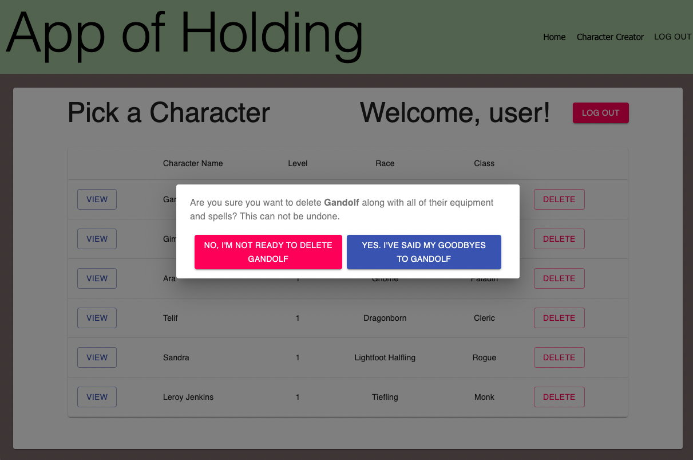
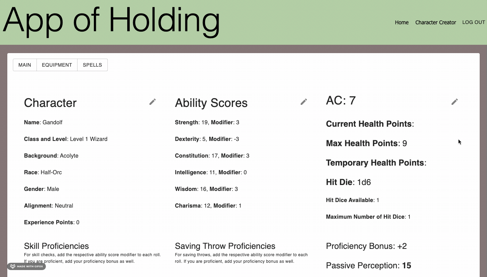
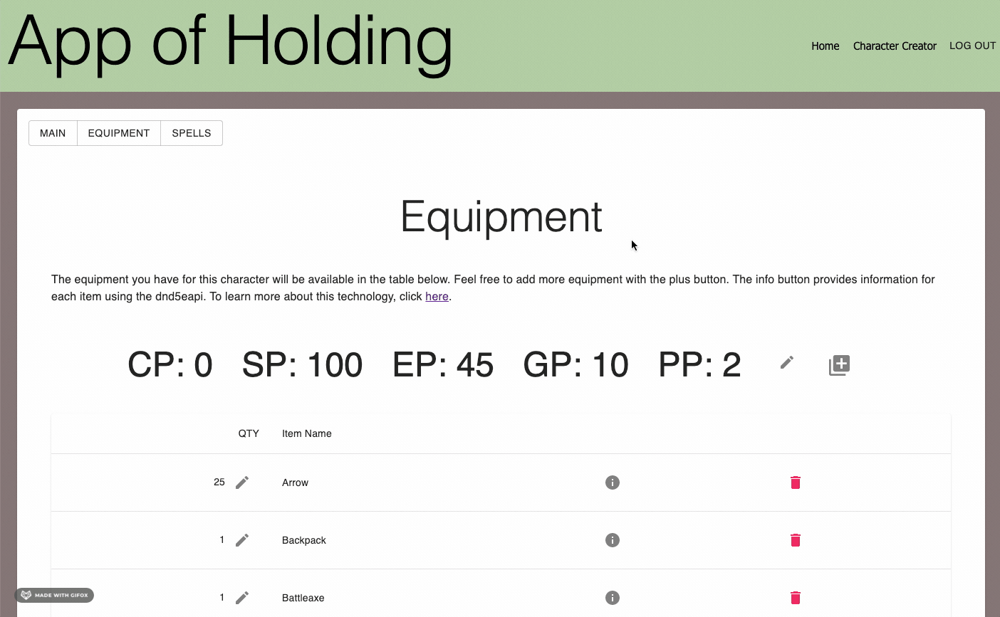

# Prime Digital Academy Solo Project: _App of Holding_

## Description

_Duration: 2 Week Sprint_

Often times, when people are first introduced to Dungeons and Dragons, they are fascinated by many aspects of the game. However, the daunting task of building that first character will oftentimes scare off potential first-time players. A lot of aspects go into your character and it can be overwhelming to know where to even begin. By reducing the amount of decisions that the player needs to make during the initial character creator, Dungeons and Dragons becomes more accessible to a larger crowd.

The App of Holding was created to reduce the amount of decisions needed to create a level 1 character for Dungeons and Dragons, as well as a convenient place to store those generated characters and edit them. Characters are generated on the `Character Creator` page, where they can input two parameters, `Play Style` and `Magic Style`, that ultimately determine the logic for a "randomly" generated character. 

With the use of authorization, all characters generated and stored are user specific and can be accessed, edited, or deleted after a user has logged on and found the character within the `My Collection` page. 

This application implements the full use of CRUD methodologies as the framework for its RESTful API. This project is not intended for sale, but as a demonstration of my ability to write a full-stack application.

To see the fully functional site, please visit: [App of Holding](https://app-of-holding.herokuapp.com/)

## Screen Shot

The `My Collection` page is the home page of the app for logged in user. It displays all characters available from the database for that user.

The user is asked to verify character deletion, upon clicking the delete button.

Play Style and Magic Style parameters are placed before a character is generated for review. The user can review the character before saving it to the database.

Many of the character stats and information are editable in the `Character Sheet` view.

Information for weapons and spells are rendered from a [3rd party api](http://www.dnd5eapi.co/).

### Prerequisites

Link to software that is required to install the app (e.g. node).

- [Node.js](https://nodejs.org/en/)
- [Postgres](https://www.postgresql.org/download/)
- [Postico](https://eggerapps.at/postico/)

## Installation

How do you get your application up and running? This is a step by step list for how another developer could get this project up and running. The good target audience in terms of knowledge, would be a fellow Primer from another cohort being able to spin up this project. Note that you do not need a paragraph here to intro Installation. It should be step-by-step.

If your application has secret keys (for example --  Twilio), make sure you tell them how to set that up, both in getting the key and then what to call it in the `.env` file.

1. Create a database named `prime_app`,
2. The queries in the `database.sql` file are set up to create all the necessary tables and populate the needed data to allow the application to run correctly. 
3. Open up your editor of choice and run an `npm install`
4. Run `npm run server` in your terminal
5. Run `npm run client` in your terminal
6. The `npm run client` command will open up a new browser tab for you!

## Usage
How does someone use this application? Tell a user story here.

1. As a user, I can create an account so that I can manage my characters.
2. As a user, I can put in parameters to influence the character created for me.
3. As a user, I can read/review the character created for me before saving it to my account.
4. As a user, I can view a full list of the characters I've created.
5. As a user, I can delete a character that I've created after they have died in a campaign or if they are taking up too much space in my collection
6. As a user, I can read/view all of the specific details of each of my characters.
7. As a user, I can edit important aspects of my character sheet, such as health, equipment, spells, ability scores, etc.
8. As a user, I can view important information about equipment and spells.

## Built With

- HTML
- CSS
- Javascript
- React
- Redux
- Node.js
- Express
- PostgreSQL
- Material-UI
- [D&D 5e API](http://www.dnd5eapi.co/)

## Acknowledgement
Thanks to [Prime Digital Academy](www.primeacademy.io) who equipped and helped me to make this application a reality, especially Edan Schwartz and Chad Smith. Thanks to my family and friends who supported me. And a big thanks to the members of my cohort for helping me solve problems and work through bugs.

## Support
If you have suggestions or issues, please email me at [dustymeyerssculpture@gmail.com](dustymeyerssculpture@gmail.com)